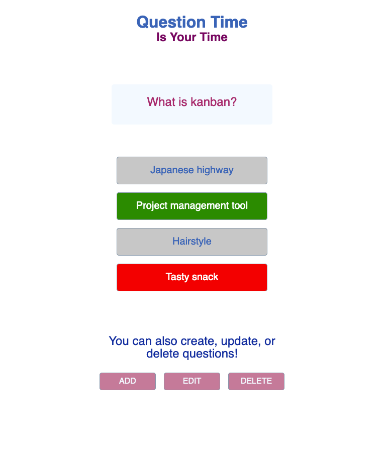

# Question Time

Answer trivia questions! If you don't like the questions, you can change or delete them. You can even add your own questions. You get to ask (and answer) the questions you want during Question Time!

Website: https://peaceful-jackson-4fb030.netlify.app/

Repo: https://github.com/ThwCorbin/question-time

API documentation: http://pub-quiz-game.herokuapp.com/doc

## Description

Question Time is a React front end that uses a MongoDB, Express, and Node.js back end that I built for an API project called [Pub Quiz](https://github.com/ThwCorbin/pub-quiz "repo on GitHub"). The JSON API I built provides access to trivia questions for a pub quiz game.[1] For the purposes of this project, I will use one trivia category: History. A user will see a question on page load. The user can answer the question and then see the answer. The app presents the user with another question. The user can change or delete the question and answers. The user can add a question. The user has access to the Pub Quiz API! Scary. But fun!

This is my seventh project for [General Assembly's](https://generalassemb.ly/ "General Assembly homepage") Software Engineering Immersive program.

## Technologies

- MongoDB
- Mongoose
- Express
- React
- Node.js
- JavaScript
- HTML
- CSS

## Features

I developed a bronze/silver/gold plan, which is available in the planning directory in this repo. I completed all bronze level features.

## Installation

- Fork and clone the repo: https://github.com/ThwCorbin/question-time
- `git clone` + copy/paste clone inside a directory of your choice
- `cd` to the question-time directory
- run `npm i` in the terminal
- note: you will also need to install mongodb globally

## License

[MIT](LICENSE.txt "MIT License text file")
